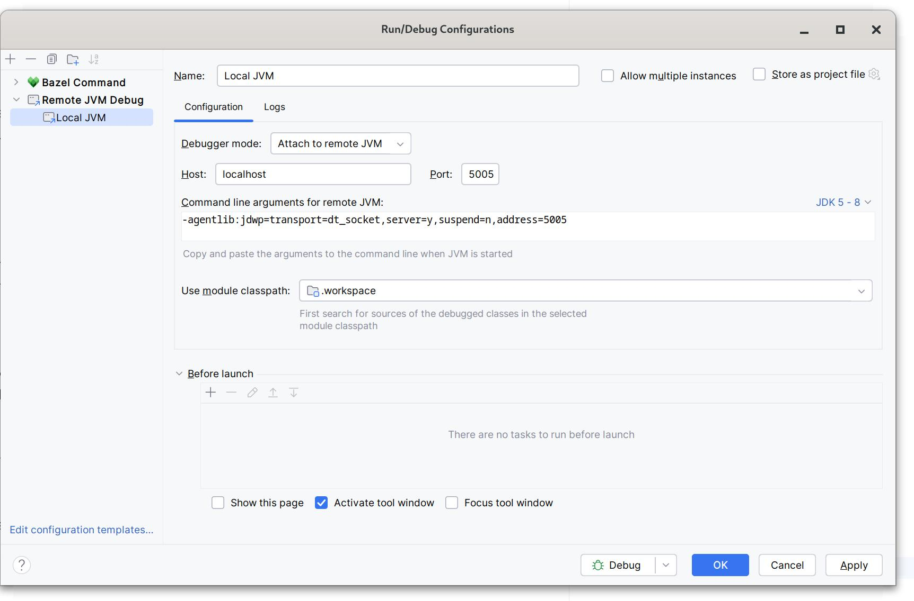

## Building Jazzer from source

### Dependencies

Jazzer has the following dependencies when being built from source:

* [Bazelisk](https://github.com/bazelbuild/bazelisk) or the version of Bazel specified in [`.bazelversion`](.bazelversion)
* One of the following C++ compilers:
  * [Clang](https://clang.llvm.org/) 9.0+ (clang-cl on Windows)
  * Xcode (Xcode.app is required, not just the developer tools)
  * GCC (should work with `--repo_env=CC=gcc`, but is not tested)

It is recommended to use [Bazelisk](https://github.com/bazelbuild/bazelisk) to automatically download and install Bazel.
Simply download the release binary for your OS and architecture and ensure that it is available in the `PATH`.
The instructions below will assume that this binary is called `bazel` - Bazelisk is a thin wrapper around the actual Bazel binary and can be used interchangeably.

### Recommended settings

If you regularly run builds and tests in the Jazzer repository, it is recommended to use Bazel's disk cache.
This will speed up incremental builds and tests, especially when switching branches.

Since a disk cache can be shared across Bazel projects, it is recommended to enable it by creating a file called `.bazelrc` in your home directory with the following contents:
```
common --disk_cache=<ABSOLUTE_HOME_PATH>/.cache/bazel-disk
```

Bazel currently doesn't remove old entries from the disk cache automatically, so you may want to do this manually from time to time (see https://github.com/bazelbuild/bazel/issues/5139#issuecomment-943534948).

```bash
find ~/.cache/bazel-disk -type f -mtime +15 -delete && find ~/.cache/bazel-disk -type f -size +500M -delete
```

### Building

Assuming the dependencies are installed, build Jazzer from source and run it as follows:

```bash
$ git clone https://github.com/CodeIntelligenceTesting/jazzer
$ cd jazzer
# Note the double dash used to pass <arguments> to Jazzer rather than Bazel.
$ bazel run //:jazzer -- <arguments>
```

You can also build your own version of the release binaries:

```bash
$ bazel build //:jazzer_release
...
INFO: Found 1 target...
Target //:jazzer_release up-to-date:
  bazel-bin/jazzer_release.tar.gz
...
```

#### Building for Android

Android builds are supported on Linux and macOS.
Local installations of an Android SDK and a corresponding side-by-side NDK are required.

Set the following environment variables:
* `ANDROID_HOME` points to the SDK root (e.g. `/home/user/Android/Sdk`)
* `ANDROID_NDK_HOME` points the NDK within the SDK (e.g. `/home/user/Android/Sdk/ndk/25.2.9519653`)

Then build Jazzer for Android via:

``` bash
$ bazel build //launcher/android:jazzer_android
```

### Running the tests

To run the tests, execute the following command:

```bash
$ bazel test //...
```

If you are bisecting a bug or otherwise want test execution to stop right after the first failure, use `--config=fail-fast`.
This is especially useful with long-running or parameterized tests.

#### Debugging

##### Internal debugging

If you need to debug an issue that can only be reproduced by an integration test (`java_fuzz_target_test`), you can start Jazzer in debug mode via `--config=debug`.
The JVM running Jazzer will suspend until a debugger connects on port `5005` (or the port specified via `DEFAULT_JVM_DEBUG_PORT`).

##### External debugging

If you need to debug an issue in an external project or application add the normal JVM debug flags to the `java` command. 
A JVM started with these settings will halt on startup until a debugger is connected.

```
-agentlib:jdwp=transport=dt_socket,server=y,suspend=y,address=5005
```

Connect to the waiting application via your favourite IDE from within the opened Jazzer project. 
In IntelliJ, you could do so by adding a new `Remote JVM Debug` run configuration and leave the settings as is.



##### Debug logs 

Jazzer also has a number of environment variables that enable additional debug logging when set to `1`:

* `JAZZER_AUTOFUZZ_DEBUG`: Print stack traces and generated code while using Autofuzz.
* `JAZZER_MUTATOR_DEBUG`: Print a tree representation of attempts to construct a structured mutator.
* `JAZZER_REFLECTION_DEBUG`: Print stack traces when reflective access from sanitizers fails.
* `RULES_JNI_TRACE`: Let the native launcher emit trace level information while locating a JDK.


### Formatting

Run `./format.sh` to format all source files in the way enforced by the "Check formatting" CI job.

## Releasing (CI employees only)

1. Push a tag of the form `v1.2.3` to trigger the "Prerelease" GitHub Actions workflow.
2. Wait for the workflow to finish (about 10 minutes)
3. When successful and happy with the results, log into https://oss.sonatype.org, select all staging repositories (usually one, can be more) under "Staging Repositories" and "Close" them.
   Wait and refresh, then select them again and "Release" them.
4. Release the draft Github release. This will automatically create a tag, push the docker images and deploy the docs (can take about a few minutes to appear at [jazzer-docs]( https://codeintelligencetesting.github.io/jazzer-docs)).
