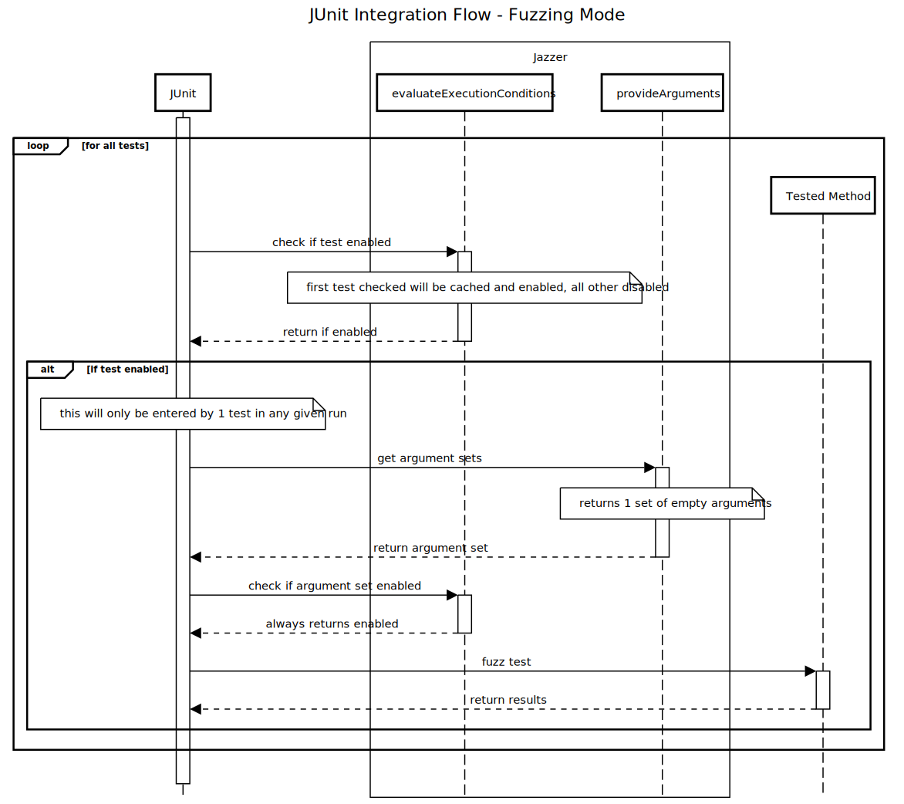
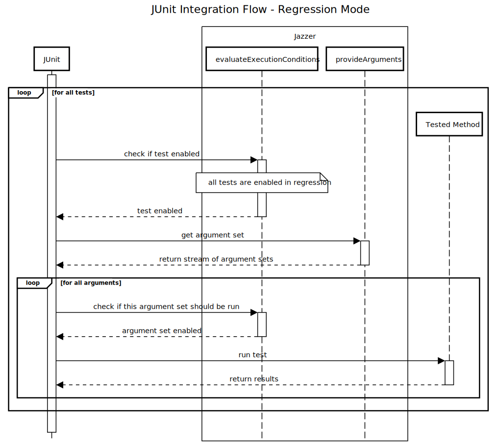

# JUnit Integration

Jazzer's JUnit integration is described on the main readme page at [JUnit 5](../README.md#junit-5). This document will
go into more details about more specific aspects of the integration.

## Mutation Framework

Classic Jazzer fuzz tests expect a single parameter of type `FuzzedDataProvider` or `byte[]`, which can be used to
create further inputs required by the function under test. This can get quite cumbersome for tests that require multiple
or complex inputs.

To address this issue, Jazzer adds the ability to expect any number of parameters of primitive and, limited, object
types. The underlying functionality, called "mutation framework", will create and mutate these parameters in a type
specific manner.

Type information enable the fuzzer to directly generate valid input and not only a low level byte representation, which
could easily break during manual object creation in the fuzz test and result in inefficient retries.

The mutation framework is designed in an extensible and composable way, so that type specific mutation logic is
encapsulated in dedicated classes, and can easily and automatically be composed into mutators for complex types.
Furthermore, new mutators for currently unsupported or custom types are directly integrated into the mutation framework
and used during generation of mutators for other types.

The mutation framework integrates with the underlying fuzzing engine and ensures stability of saved findings and corpus
entries, so that changes in the mutation framework itself or the mutation logic of specific mutators don't invalidate
existing findings or corpus entries.

The mutation framework is located in the `com.code_intelligence.jazzer.mutation` package.

**Note**: If a fuzz function still expects a single `FuzzedDataProvider` or `byte[]` parameter, the mutation framework
will not be used!

The example below shows how to use complex data types in a fuzz test. Any supported type can be used as a parameter of a
fuzz test. The mutation framework will automatically create and mutate the parameters accordingly.

```java
record SimpleTypesRecord(boolean bar, int baz) {
}

@FuzzTest
public void testSimpleTypeRecord(SimpleTypesRecord record) {
    doSomethingWithRecord(record);
}
``` 

### Supported Types

Type specific mutations are located in the `com.code_intelligence.jazzer.mutation.mutator` package.

Mutators are free to implement mutations in any way they see fit, e.g. the integral type mutator can perform bit flips,
random walks, pseudo random number picks between specified `min` and `max` values, or fall back to the underlying
fuzzing engine mutation.

Mutators automatically compose into mutators for complex types, e.g. a list mutator will use the mutator for the list
element type to generate and mutate list elements and so on. If an unsupported type is encountered no mutator can be
created.

Currently supported types are:

| Mutator                        | Type(s)                                                                                                | Notes                                                                                                                                                                    |
|--------------------------------|--------------------------------------------------------------------------------------------------------|--------------------------------------------------------------------------------------------------------------------------------------------------------------------------|
| Boolean                        | `boolean`, `Boolean`                                                                                   |                                                                                                                                                                          |
| Integral                       | `byte`, `Byte`, `short`, `Short`, `int`, `Int`, `long`, `Long`                                         |                                                                                                                                                                          |
| Floating point                 | `float`, `Float`, `double`, `Double`                                                                   |                                                                                                                                                                          |
| String                         | `java.lang.String`                                                                                     |                                                                                                                                                                          |
| Enum                           | `java.lang.Enum`                                                                                       |                                                                                                                                                                          |
| InputStream                    | `java.io.InputStream`                                                                                  |                                                                                                                                                                          |
| Time                           | `java.time.LocalDate`, `java.time.LocalDateTime`, `java.time.LocalTime`, `java.time.ZonedDateTime`     |                                                                                                                                                                          |
| Array                          | Arrays holding any other supported type (e.g. `byte[]`, `Integer[]`, `Map[]`, `String[]`, etc.)        |                                                                                                                                                                          |
| List                           | `java.util.List`                                                                                       |                                                                                                                                                                          |
| Map                            | `java.util.Map`                                                                                        |                                                                                                                                                                          |
| Record                         | `java.lang.Record`                                                                                     | Arbitrary Java Records, if supported by JVM version                                                                                                                      |
| Setter-based JavaBean          |                                                                                                        | Any class adhering to the [JavaBeans Spec](https://www.oracle.com/java/technologies/javase/javabeans-spec.html), see [JavaBeans Support](#javabeans-support) for details |
| Constructor-based JavaBean     |                                                                                                        | Any class adhering to the [JavaBeans Spec](https://www.oracle.com/java/technologies/javase/javabeans-spec.html), see [JavaBeans Support](#javabeans-support) for details |
| Constructor-based Java Classes |                                                                                                        | Any class requiring constructor parameters, but not offering getter methods, see [constructor-based classes](#constructor-based-classes) for details                     |
| Builder                        |                                                                                                        | See [Builder pattern support](#builder-pattern-support) for details                                                                                                      |
| FuzzedDataProvider             | `com.code_intelligence.jazzer.api.FuzzedDataProvider`                                                  |                                                                                                                                                                          |
| Protobuf                       | `com.google.protobuf.Message`, `com.google.protobuf.Message.Builder`, `com.google.protobuf.ByteString` | Classes generated by the Protobuf toolchain                                                                                                                              |
| Nullable                       |                                                                                                        | Any reference type will occasionally be set to `null`                                                                                                                    |

### Annotations

It is sometimes helpful to provide additional information about the Fuzz Test
parameters, e.g. to specify the range of integers, or the maximum length of a
string. This is done using annotations directly on the parameters.

**Note**: Annotations are used on best effort basis, meaning that the fuzzer
will try to honor specified constraints, but can not guarantee it.

All annotations reside in the `com.code_intelligence.jazzer.mutation.annotation`
package.

| Annotation        | Applies To                                                     | Notes                                                                                                       |
|-------------------|----------------------------------------------------------------|-------------------------------------------------------------------------------------------------------------|
| `@Ascii`          | `java.lang.String`                                             | `String` should only contain ASCII characters                                                               |
| `@InRange`        | `byte`, `Byte`, `short`, `Short`, `int`, `Int`, `long`, `Long` | Specifies `min` and `max` values of generated integrals                                                     |
| `@InRangeFloat`   | `float`, `Float`                                               | Specifies `min` and `max` values of generated floats                                                        |
| `@InRangeDouble`  | `double`, `Double`                                             | Specifies `min` and `max` values of generated doubles                                                       |
| `@NotNull`        |                                                                | Specifies that a reference type should not be `null`                                                        |
| `@WithLength`     | `byte[]`                                                       | Specifies the length of the generated byte array                                                            |
| `@WithUtf8Length` | `java.lang.String`                                             | Specifies the length of the generated string in UTF-8 bytes, see annotation Javadoc for further information |
| `@WithSize`       | `java.util.List`, `java.util.Map`                              | Specifies the size of the generated collection                                                              |
| `@UrlSegment`     | `java.lang.String`                                             | `String` should only contain valid URL segment characters                                                   |

The example below shows how Fuzz Test parameters can be annotated to provide
additional information to the mutation framework.

```java title="Example" showLineNumbers
record SimpleTypesRecord(boolean bar, int baz) {}

@FuzzTest
public void testSimpleTypeRecord(@NotNull @WithSize(min = 3, max = 100) List<SimpleTypesRecord> records) {
    doSomethingWithRecord(record);
}
```

#### Annotation constraints

Often, annotations should be applied to a type and all it's nested component
types. This use-case is supported by the annotation's `constraint` property. It
can be set to `PropertyConstraint.RECURSIVE` so that the annotation is
propagated down to all subcomponent types.  
All above-mentioned annotations support this feature.

For example, if a Fuzz Test expects a `List` of `List` of `Integer` as
parameter, and both the lists and their values must not be `null`, the
annotation `@NotNull(constraint = PropertyConstraint.RECURSIVE)` could be added
on the root type.

```java title="Example" showLineNumbers
@FuzzTest
public void fuzz(@NotNull(constraint = PropertyConstraint.RECURSIVE) List<List<Integer>> list) {
    // list is not null and does not contain null entries on any level
    assertDeepNotNull(list);
}
```

### JavaBeans support

Jazzer can generate and mutate instances of classes adhering to the
[JavaBeans Spec](https://www.oracle.com/java/technologies/javase/javabeans-spec.html).

To serialize and deserialize Java objects to and from corpus entries, Jazzer can
use setters, constructors and getters to pass values to a JavaBean and extract
them back out from it.

#### Setter-based approach

The setter-based approach requires a class to provide a default constructor with
no arguments. The corresponding methods are looked up by name and must adhere to
the JavaBeans Spec naming convention, meaning `setXX` and `getXX`/`isXX` methods
for property `XX`. A JavaBean can have additional getters corresponding to
computed properties, but it is required that all setters have a corresponding
getter.

```java title="Example" showLineNumbers
public static class FooBean {
    private String foo;

    public String getFoo() {
        return foo;
    }

    public void setFoo(String foo) {
        this.foo = foo;
    }
}

@FuzzTest
public void testFooBean(FooBean fooBean) {
    // ...
}
```

#### Constructor-based approach

The constructor-based approach requires a class to provide a constructor with
arguments. If multiple constructors are available, the one with the most
supported parameters will be preferred.

The lookup of matching getters relies on the Java bean's property names. As a
class can have further properties or internal states, this approach relies on
the constructor parameter names. Since parameter names are not always available
at runtime, they explicitly have to be compiled into the class file with the use
of the JavaBeans `@ConstructorProperties` annotation, to specify property names
explicitly.

```java title="Example" showLineNumbers
public static class PropertyNamesBean {
    private final String bar;

    public PropertyNamesBean(String bar) {
        this.bar = bar;
    }

    public String getBar() {
        return bar;
    }
}

public static class ConstructorPropertiesBean {
    private final String foo;

    @ConstructorProperties({"bar"})
    public PropertyNamesBean(String foo) {
        this.bar = foo;
    }

    public String getBar() {
        return foo;
    }
}

public static class FallbackTypeBean {
    private final String foo;

    public PropertyNamesBean(String foo) {
        this.bar = foo;
    }

    public String getSomething() {
        return foo;
    }
}

@FuzzTest
public void testBeans(PropertyNamesBean propertyNamesBean, ConstructorPropertiesBean constructorPropertiesBean, FallbackTypeBean fallbackTypeBean) {
    // ...
}
```

### Constructor-based classes

Jazzer can generate and mutate instances of classes that build up their internal
state via constructor parameters, and, in contrast to
[JavaBeans](#javabeans-support), don't offer getter methods.

The following class would fall into this category:

```java title="Constructor-based class" showLineNumbers
class ImmutableClassTest {

    static class ImmutableClass {
        private final int bar;
        public ImmutableClass(int foo) {
            this.bar = foo * 2;
        }
        String barAsString() {
            return String.valueOf(bar);
        }
    }

    @FuzzTest
    void fuzzImmutableClassFunction(ImmutableClass immutableClass) {
        if (immutableClass != null && "42".equals(immutableClass.barAsString())) {
            throw new RuntimeException("42!");
        }
    }
}
```

### Builder pattern support

The [builder pattern](https://en.wikipedia.org/wiki/Builder_pattern) is a common
[design pattern](https://en.wikipedia.org/wiki/Software_design_pattern) to
simplify the construction of complex objects.

- A common implementation gathers all required parameters in the `builder` and
  passes them to the constructor of the target class.
- Another approach is used for `builder`s supporting a nested type hierarchy in
  the target class. In this situation the `builder` itself is passed into the
  constructor of the target class.

**Note**: These pattern are generated by the commonly used
[Lombok](https://projectlombok.org/) `@Builder` and `@SuperBuilder` annotations.

The examples below use [Lombok](https://projectlombok.org/) to generate
appropriate `builder` classes:

```java title="@Builder pattern support" showLineNumbers
class SimpleClassFuzzTests {

    @Builder
    static class SimpleClass {
        String foo;
        List<Integer> bar;
        boolean baz;
    }

    @FuzzTest
    void fuzzSimpleClassFunction(@NotNull SimpleClass simpleClass) {
        someFunctionToFuzz(simpleClass);
    }
}
```

```java title="@SuperBuilder pattern support" showLineNumbers
class SimpleClassFuzzTests {

    @SuperBuilder
    static class ParentClass {
        String foo;
    }

    @SuperBuilder
    static class ChildClass extends ParentClass {
        List<Integer> bar;
    }

    @FuzzTest
    void fuzzChildClassFunction(@NotNull ChildClass childClass) {
        someChildFunctionToFuzz(childClass);
    }
}
```

### FuzzedDataProvider

The `FuzzedDataProvider` is an alternative approach commonly used in programming
languages like C and C++. It provides an intuitive interface to deconstruct
fuzzer input with type-specific functions, e.g. `consumeString`,
`consumeBoolean` or `consumeInt`. Jazzer's Java implementation follows the
`FuzzedDataProvider` of the [LLVM Project](https://llvm.org/).

This programmatic approach offers very fine-grained control, but requires much
more effort to build up needed data structures.

Below is an example of a simple Fuzz Test using the `FuzzedDataProvider`:

```java title="Example" showLineNumbers
import com.code_intelligence.jazzer.api.FuzzedDataProvider;
import com.code_intelligence.jazzer.junit.FuzzTest;

class ParserTests {
   @Test
   void unitTest() {
      assertEquals("foobar", SomeScheme.decode(SomeScheme.encode("foobar")));
   }

   @FuzzTest
   void fuzzTest(FuzzedDataProvider data) {
      String input = data.consumeRemainingAsString();
      assertEquals(input, SomeScheme.decode(SomeScheme.encode(input)));
   }
}
```

## Implementation

Jazzer's JUnit integration starts from
the [`FuzzTest`](../src/main/java/com/code_intelligence/jazzer/junit/FuzzTest.java) annotation. As mentioned in the
annotation's javadoc, our integration runs in one of two modes: fuzzing and regression. Fuzzing mode will generate new
inputs to feed into the tests to find new issues and regression mode will run the tests against previous findings, no
fuzzing is done. The main entrypoints for the actual integration code are found in two of the annotations
on `FuzzTest`: `@ArgumentsSource(FuzzTestArgumentsProvider.class)` and `@ExtendsWith(FuzzTestExtensions.class)`.

Because these same files and functions are involved in two mostly separate sets of functionality, this will look at the
flow of the different methods involved in integrating with JUnit in fuzzing mode (when `JAZZER_FUZZ` is set to a truthy 
value (`true`, `1`, `yes`)) and in regression mode (when `JAZZER_FUZZ` is not set) separately.

### Fuzzing Flow

JUnit will call the following methods for each test marked with `FuzzTest`.

#### `evaluateExecutionCondition`

The first call to this test will determine if the test should be run at all. In fuzzing mode, we only allow one test to
be run due to global state in libfuzzer that would mean multiple tests would interfere with each other. Jazzer will
accept the first fuzz test that is checked as the test to be run. It will cache which test it has seen first and
return that test as enabled.

If this returns that a test is disabled, JUnit will not run the rest of these methods for this test and instead skip
to the next one.

#### `provideArguments`

This will configure the fuzzing agent to set up code instrumentation, instantiate a `FuzzTestExecutor` and put it into
JUnit's `extensionContext`, then create a stream of a single empty argument set. As the comment mentions, this is so
that JUnit will actually execute the test but the argument will not be used.

#### `evaluateExecutionCondition`

This will be called for each argument set for the current test. In fuzzing mode, there will only be the single
empty argument set which will be enabled.

#### `interceptTestTemplateMethod`

This will call `invocation.skip()` which prevents invoking the test function with the default set of
arguments `provideArguments` created. It will instead extract the `FuzzTestExecutor` instance from
the `extensionContext` and then calls `FuzzTestExecutor#execute` which creates a `FuzzTargetRunner` to run the actual
fuzzing.

Crashes are saved in `resources/<package>/<test file name>Inputs/<test method name>` and results that are interesting to
libfuzzer are saved in `.cifuzz-corpus`.

### Regression Flow

Similar to fuzzing mode, JUnit will call these methods for each test marked with `FuzzTest`.

#### `evaluateExecutionCondition`

This checks if the given test should be run at all. In regression mode, all tests are run so this will always return
enabled.

#### `provideArguments`

This will configure the fuzzing agent as in fuzzing mode, then gather test cases to run from the following sources:

1. A default argument set of just an empty input
2. A set of arguments from the associated resources directory
3. If a `.cifuzz-corpus` directory exists, relevant entries from that are added as well

Prior to returning, the stream of test cases is put through `adaptInputsForFuzzTest` to turn the raw bytes from the
files into the actual types to be given to the tested function.

##### Resources Tests

The tests from the resources directory are gathered by `walkInputs`. This will look for inputs in two places:

- `resources/<package>/<test class name>Inputs` - files found directly within this directory will be used as inputs for
  any tests within this class. This allows for easy sharing of corpus entries. Jazzer does not automatically put entries
  here, instead a human will need to decide a finding should be shared and manually move it.
- `resources/<package>/<test class name>Inputs/<test method name>` - files found in this directory and any directory
  under it are used as inputs for only the test of the same name.

JUnit will use the file's name as the name of the test case for its reporting. It also accepts .jar files where it will
search with the given directory in the jar.

##### Corpus

The corpus kept in `.cifuzz-corpus/<test class name>/<test method name>` holds any inputs that libfuzzer found worth
saving and not necessarily just inputs that caused a crash. Jazzer is able to set the directory but the contents of
these directories are managed entirely by libfuzzer. Unlike with the resources test inputs above, this will not look
in `.cifuzz-corpus/<test class name>` for shared test cases. This is a limitation of libfuzzer.

#### `evaluateExecutionCondition`

This will run once per argument set returned by `provideArguments` for this test. All argument sets will return as
enabled.

#### `interceptTestTemplateMethod`

This will run for each individual test case for each fuzz test and will mostly just allow the test function to proceed
with the provided arguments. Prior to the call to the test, it will enable the agent's hooks and then disable them
afterward. It will also check for and report any findings from Jazzer to JUnit.

### Diagrams

Below are two sequence diagrams for how JUnit calls `evaluateExecutionConditions` and `provideArguments` in fuzzing and
regression mode. These diagrams ignore `interceptTestTemplateMethod` for brevity as its behavior and place in the
sequence is more clear.

#### Fuzzing



#### Regression


